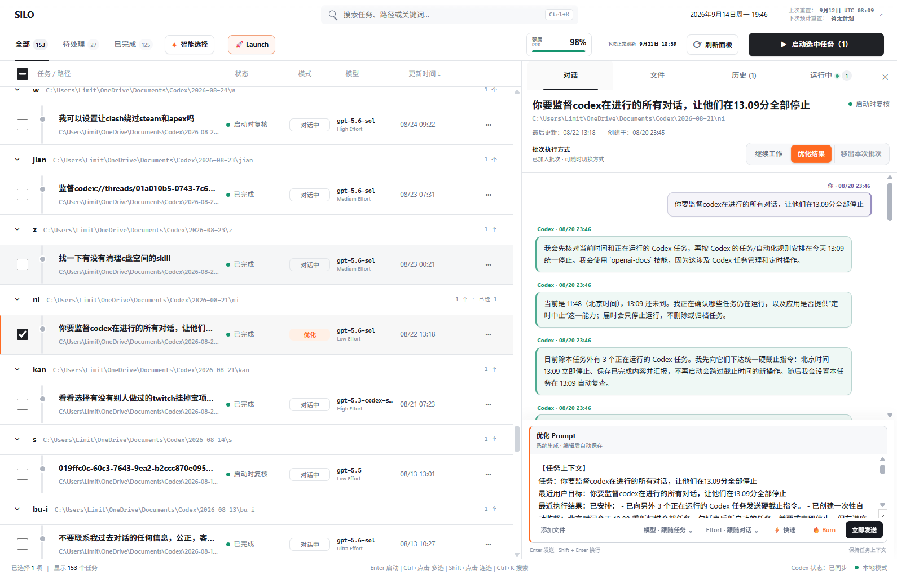
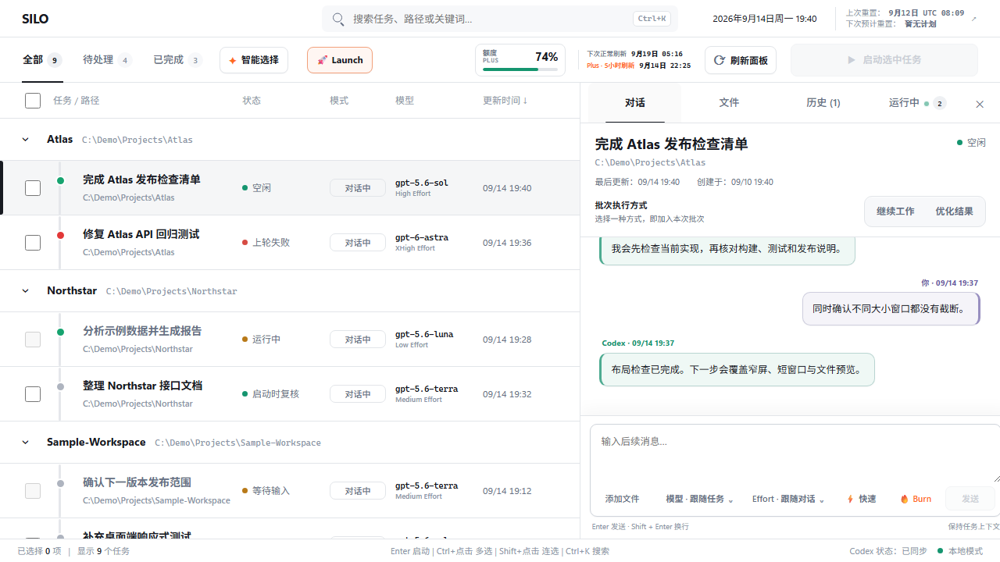
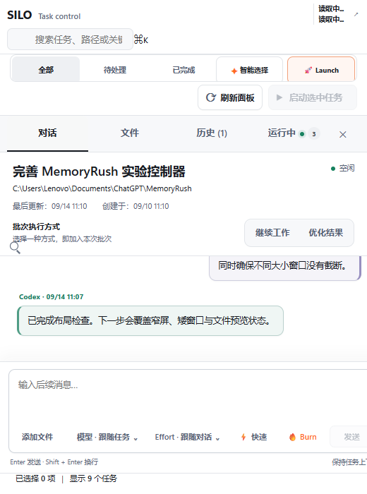

# SILO Task Control

[English](README.md) | [简体中文](README.zh-CN.md)

SILO is a lightweight Codex control panel for scanning existing tasks across projects, reviewing the exact Continue or Optimize prompt for each task, and dispatching a confirmed batch through Codex's native task tools.

Current release: **v0.6.2** (`0.6.2+codex.20260914`)



> The overview above is a maintainer-provided capture of SILO in Codex. The focused conversation and compact-layout screenshots below are rendered from the current `ui/control.html` with fictional local Mock Host data.

## Interface guide

### Task filters and one-click presets


| Control | What it does |
|---|---|
| **All / To do / Completed** | Changes only the visible task view. It does not alter the selection or launch anything. Each badge shows the number of tasks in that view. |
| **Smart select** | Reads at most the latest two turns of candidate tasks and recommends which ones to Continue or Optimize. It proposes; it does not run. |
| **🚀 Launch** | Uses Smart select logic, then applies Continue, Burn, Fast, and conversation-following model/effort settings. It is a reversible preset: press it again to remove the selections it added. A separate launch confirmation is still required. |
| **Task checkbox** | Adds that task to or removes it from the current batch. |
| **Task title** | Opens the task details without changing batch selection. |
| **⋯** | Opens additional actions for that task. |

### Personal quota, refresh, and dispatch


| Control | What it does |
|---|---|
| **Quota card** | Shows the current Codex account balance. Plus accounts also show the five-hour window; the adjacent value shows the next standard-window reset. |
| **Refresh panel** | Rescans tasks, running state, and quota inside the current SILO panel. It does not create a chat or send a prompt to another task. |
| **Launch selected** | Opens the batch review dialog. It becomes available only when tasks are selected and their prompts are ready; dispatch happens only after confirmation. |

### Top right: Tibo reset prediction


This area shows the **global goodwill-reset outlook**. When SILO opens, it reads the last verified reset and the next prediction from the third-party [codex-reset.com](https://codex-reset.com/) tracker. That site follows Tibo's ([@thsottiaux](https://x.com/thsottiaux)) public X/Twitter posts, verified events, and historical reset cadence. Click the area to open the detailed forecast, timeline, and sources.

This is different from the personal quota card: the quota card reflects the signed-in Codex account's own windows, while the Tibo area summarizes public global-reset signals. SILO displays “No schedule” when there is no credible announced window. This is a third-party prediction, not an official OpenAI commitment.

### Conversation, mode, and per-task controls


| Control | What it does |
|---|---|
| **Conversation** | Shows message history and lets you send a follow-up prompt as you would in Codex. |
| **Files** | Browses text files referenced by the conversation or found in its working directory, with an in-panel preview. |
| **History** | Shows SILO batches and their status changes. |
| **Running** | Collects Codex tasks that are currently running or waiting for attention and keeps their state updated. |
| **Continue** | Continues from the existing conversation context and generates the matching Continue prompt. |
| **Optimize** | Reviews and improves an existing result and generates the matching Optimize prompt. |
| **Model / Effort** | Follows the original conversation by default, with optional per-task overrides. |
| **⚡ Fast** | Requests the Codex Fast service tier for the current send. |
| **🔥 Burn** | Appends a throughput-oriented parallel-execution strategy. Turning on Burn also enables Fast, without weakening verification or safety boundaries. |
| **Send / Send now** | Sends the current message or reviewed execution prompt to the original Codex task. |
| **×** | Closes the detail view and returns to the task list. |

## What SILO gives you

SILO keeps the high-frequency controls in one workbench: find the right task, decide whether to Continue or Optimize it, review the exact prompt and settings, then launch only after confirmation.

### Scan, understand, and select

The task ledger groups conversations by project and shows live state, mode, model, reasoning effort, and last update together. **Smart select** inspects recent context and recommends a focused batch; **🚀 Launch** applies that recommendation as a reversible preset instead of selecting everything or starting immediately. The header also keeps quota remaining and reset timing visible without taking over the workspace.

### Continue or Optimize in context



Selecting a task opens its conversation in place. You can read the latest user and Codex messages, choose **Continue** or **Optimize**, edit the generated prompt, and override Burn, Fast, model, or reasoning effort before sending. The Files, History, and Running tabs stay attached to the same task, so inspection does not lose your place.

### The same workflow in a compact panel



At narrow widths the inventory gives way to a focused task view while search, task filters, mode selection, conversation, and launch controls remain reachable. SILO uses the same responsive panel on Windows and macOS.

## Install

Add the GitHub repository as a Codex marketplace, then install SILO:

```sh
codex plugin marketplace add LIMITEDRUSH/silo-task-control
codex plugin add silo-en@silo-plugins
# Existing Chinese package name is also supported:
codex plugin add silo-cn@silo-plugins
```

For the dedicated macOS package that preserves the v0.6.2 workbench while fitting the Codex side panel:

```bash
codex plugin add silo-mac@silo-plugins
```

Restart Codex after the first installation. Open **SILO** from the sidebar or start a new task and ask:

```text
$silo-task-control Open the control panel and scan my current tasks.
```

Both package names now use the same automatic localization behavior. SILO reads the host Codex locale first and falls back to the browser/system locale; the panel and generated Continue/Optimize prompts stay in sync without an in-panel language switch. The `silo-cn` and `silo-en` names remain available for upgrade compatibility.

Update later with:

```sh
codex plugin marketplace upgrade silo-plugins
codex plugin add silo-en@silo-plugins
```

SILO supports Windows and macOS and requires Codex Desktop plus Node.js 22.5 or newer. Both platforms run the same bundled MCP server and the same responsive `control.html`, so the in-Codex UI and feature set stay identical.

On macOS, also install the current [Codex CLI](https://developers.openai.com/codex/cli) so `codex` is available in your shell. SILO recognizes the official standalone install under `~/.local/bin` as well as Homebrew locations.

## Highlights

- Fast local task inventory with Codex-native running-state synchronization and a SQLite fallback.
- Automatic Simplified Chinese/English localization that follows the local Codex language.
- Minimal **All / To do / Completed / Smart select** workflow with global search and project grouping.
- Reversible **🚀 Launch** preset that uses Smart select recommendations, then applies Continue, Burn, Fast, and conversation-following model/effort settings without starting tasks immediately.
- Exact per-task prompt review, Continue/Optimize mode, independent Burn strategy, model and reasoning controls, and explicit launch confirmation.
- A live activity rail backed by durable native jobs, atomic target claims, and progress restoration after the panel or server restarts.
- Lightweight quota polling and reset prediction. Reset information is fetched from the third-party [codex-reset.com](https://codex-reset.com/) service when the panel opens.
- Keyboard navigation: `/` focuses search, arrows move between visible tasks, `X` toggles selection, `Space` opens details, and `Esc` clears the batch without deleting drafts.

## How dispatch works

Opening, scanning, filtering, and Smart select are read-only. Smart select reviews at most the latest two turns of recent candidates and proposes Continue or Optimize without launching anything.

Launch requires an explicit review dialog. SILO persists a short-lived plan, sends a visible follow-up message, re-reads each target through native Codex task tools, skips active or attention-blocked tasks, atomically claims each eligible target, and records progress in the activity rail. It never creates, forks, archives, renames, or interrupts unrelated tasks.

## External panel

Choose **External window** in SILO. On Windows, you can also double-click `desktop\Start SILO.cmd`; on macOS, open `desktop/Start SILO.command`. The launcher starts a loopback-only service and opens the same panel in an app-style browser window. macOS prefers Chrome, Edge, Brave, or Chromium and falls back to the default browser. The Codex CLI is discovered from `CODEX_CLI_PATH`, `PATH`, or common Homebrew locations.

SILO stores its transient desktop activity under `%LOCALAPPDATA%\SILO` on Windows and `~/Library/Application Support/SILO` on macOS. Task history remains in the local Codex data directory (`CODEX_HOME` or `~/.codex`) on both platforms.

## Sidebar entry

SILO advertises its MCP App as a global entry point, allowing compatible Codex Desktop builds to show **SILO** in the sidebar. This metadata is still an undocumented host behavior. After a Codex Desktop upgrade, run:

```sh
npm run sidebar-doctor
```

The doctor performs a read-only compatibility check. SILO does not patch Codex or modify `app.asar`.

## Development

```sh
npm install
npm run check
```

The bundled MCP server is `dist/server.mjs`.

## Safety

- Scans and plan creation are read-only.
- Plans expire after 15 minutes and contain only previously scanned task IDs.
- Dispatch requires explicit confirmation and produces a visible Codex message.
- Edited prompts are sent exactly as reviewed; Burn is appended once when enabled.
- Every target is checked again immediately before dispatch.
- The desktop STOP control affects only child tasks launched by that SILO desktop process.

## License

MIT
